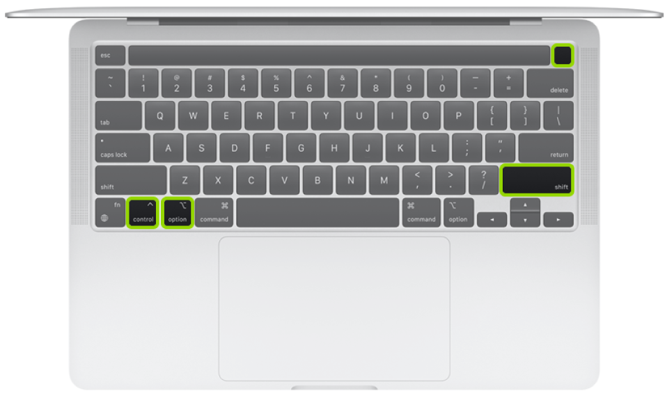

DFU mode (Device Firmware Update) is the prerequisite for any **Revive** or **Restore** of an Apple silicon Mac. Unlike recovery mode, the device shows **no image** while in DFU — no Apple logo, no display, and on MagSafe no charging LED either. The screen stays fully black; that is normal and not a fault.

{}
As of **macOS Sonoma (14)**, a Mac in DFU mode can be revived or restored directly from the **Finder** on a second Mac — Apple Configurator 2 is no longer needed. The host detects the DFU-mode device and shows **Revive Mac** and **Restore Mac** buttons in Finder. Configurator still works, but is only needed for older host systems or batch workflows.
{}

## Requirements

- A **second Mac** (host) running **macOS Sonoma 14 or later** for the Finder method (or [Apple Configurator 2](https://apps.apple.com/us/app/apple-configurator/id1037126344) on older systems).
- A **USB-C cable** that supports **data and charging** (e.g. the Apple USB-C Charge Cable) — **not** a Thunderbolt 3 cable, and not a charge-only cable.
- A connection to the **correct DFU port** on the target (see below).
- The target must have **some charge** (see the battery note below).

## The key combination and timing

On Apple silicon MacBooks you use three keys plus the power button (Touch ID):

- **Left Control** (⌃)
- **Left Option** (⌥)
- **Right Shift** (⇧)
- **Power button** (Touch ID, top right)

Sequence:

1. **Shut the device down** completely.
2. Press **Power + left Control + left Option + right Shift** at the same time and hold for **exactly 10 seconds** (count it out deliberately).
3. After exactly 10 seconds, **release the three keys** — but **keep holding the power button**.
4. Keep holding power for **another ~5–10 seconds**, until the large **DFU window** appears on the host.
5. Only then release the power button.

{}
The reliable, counted 10-second method comes from Mac admin **Mr. Macintosh** and hits a near-100% success rate in practice. Apple's own note only says a vague "about 10 seconds" — the real trick is **counting precisely** instead of estimating. If no DFU window appears within ~20 seconds total, stop and start over.

Full walkthrough with screenshots: [Restore macOS Firmware on an Apple Silicon Mac + Boot to DFU Mode — mrmacintosh.com](https://mrmacintosh.com/restore-macos-firmware-on-an-apple-silicon-mac-boot-to-dfu-mode/)
{}

## Which port?

Only **one specific port** on the target is the DFU port. On the wrong port no DFU window appears, no matter how clean your timing is. The location depends on the model and **changed on the 2025 models** — Apple describes each position "facing the left side of the Mac," i.e. among the USB-C ports on the **left side** of the device:

- **MacBook Air up to 2024 / most MacBook Pro:** the **front** of the two left-side ports (Apple: "the leftmost USB-C port when facing the left side").
- **MacBook Air 2025 and later, and the 14" base-M4/M5 MacBook Pro:** the **other** of the two left-side ports (Apple: "the rightmost USB-C port when facing the left side") — **not** the right side of the device, but the second left-side port.

Apple lists the exact position per model: [Identify the DFU port — support.apple.com](https://support.apple.com/en-us/120694).

{}
If no DFU window appears after a clean 10-second attempt, the port is usually just wrong — use the other port on the device and try again. It must be a **USB-C data-and-charge cable**, not a charge-only cable and not a Thunderbolt 3 cable.
{}

## The battery must be charged — and the "pre-SMC" trick

A Revive or Restore **won't work on a completely empty battery** — the device needs some charge. It gets tricky when a device is stuck in the **pre-SMC state**: it won't charge from the cable at all and looks "dead."

The way out: **start a Revive anyway.** Even if the Revive fails on a timeout, the device loads a **RAMDisk with a working SMC component** during the attempt, which lets the Mac charge again. Then **leave it on the cable**, let it charge a bit, and try the Revive again — now with enough charge.

## Detailed logs in Console (Console.app)

When the Revive/Restore is run from the **Finder**, macOS writes a **very detailed log** on the host. The whole process can be followed live and reviewed afterwards in **Console** (Console.app).

These logs are invaluable for **proper diagnosis**: they show exactly which phase a job fails in — firmware write, the transition step, or a USB problem — and give the specific error code (e.g. the [4042 error in the transition step](/wiki/en/docs/mac-repair/apple-silicon/macbook-update-26-4-1-dfu-4042/)). Without these logs a restore is guesswork; with them you can decide deliberately whether a Revive, a different IPSW, or a hardware fix is needed.

## Technical DFU without a working keyboard (jumper method)

If the device can't be put into DFU from the keyboard — a dead keyboard, a disconnected top case, or a bare logic board on the bench — the **FORCE_DFU** signal can be triggered on the board directly. The signal is pulled to the correct rail (PP1V25 / 1.25 V); on most boards the pull-up resistor is not populated, so you have to work from the schematic. This method works with no keyboard at all and is far more reliable in day-to-day repair.

Board-specific jumper points and schematic notes:
[DFU Mode Restore (Macs) — logi.wiki](https://logi.wiki/index.php?title=DFU_Mode_Restore_(Macs))

## Revive vs. Restore

Once the DFU window appears, two actions are offered:

- **Revive** — reinstalls firmware and recoveryOS only. **User data is preserved.** First choice for firmware trouble after an update.
- **Restore** — erases the whole device and reinstalls from scratch. **All data is lost.** Only when the device is meant to be wiped anyway.

A practical Revive case study: [MacBook update problems after macOS 26.4.1 (DFU error 4042)](/wiki/en/docs/mac-repair/apple-silicon/macbook-update-26-4-1-dfu-4042/).

## Apple's official guide

- [How to revive or restore Mac firmware (Finder) — support.apple.com](https://support.apple.com/en-us/108900)
- [Identify the DFU port — support.apple.com](https://support.apple.com/en-us/120694)
- [Revive or restore a Mac with Apple silicon using Apple Configurator — support.apple.com](https://support.apple.com/guide/apple-configurator-mac/revive-or-restore-a-mac-with-apple-silicon-apdd5f3c75ad/mac)

## Further reading

- [logi.wiki](https://logi.wiki) — technical articles on MacBook repair
- [repair.wiki](https://repair.wiki) — community documentation on device repair
