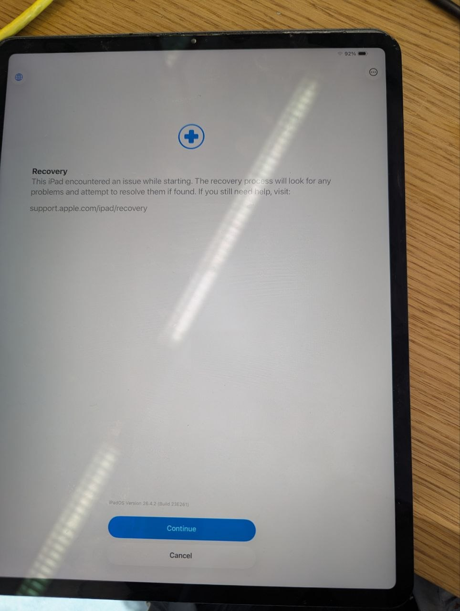
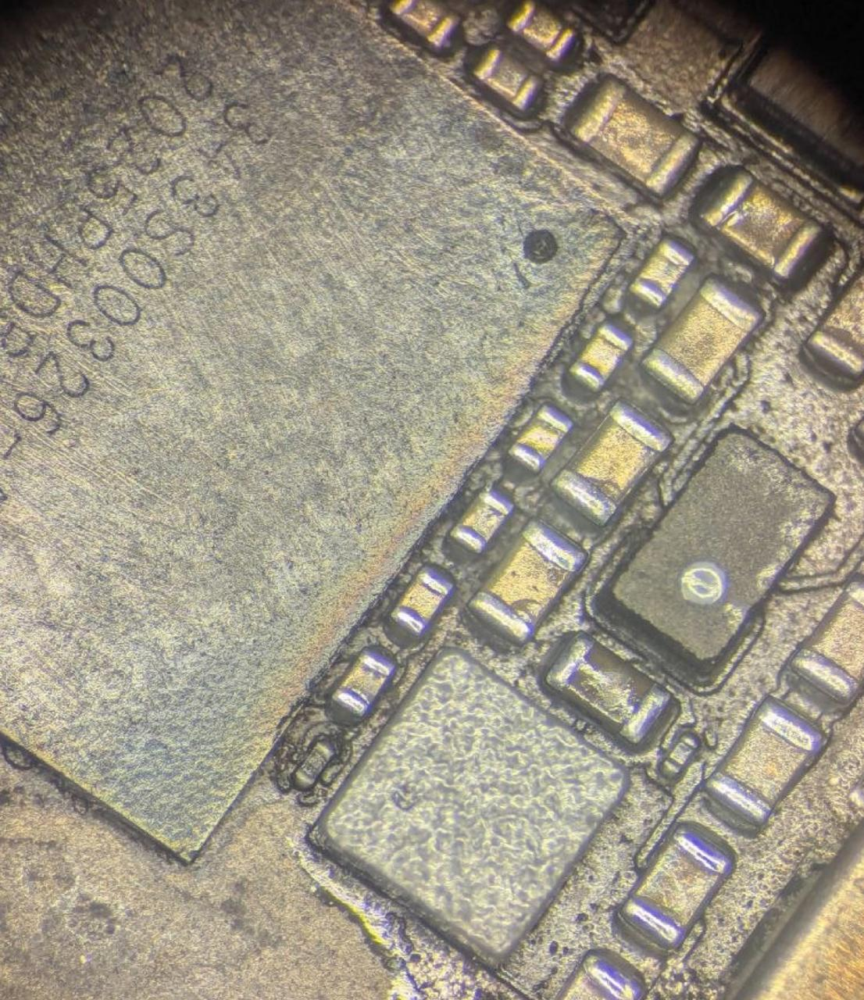
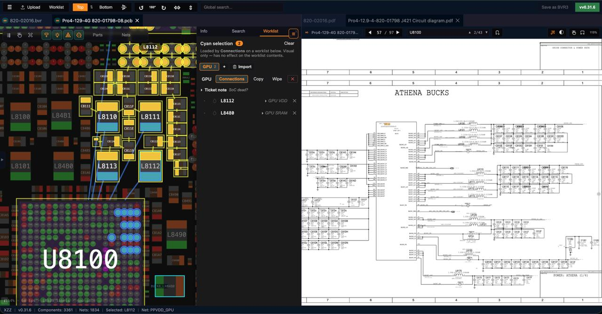
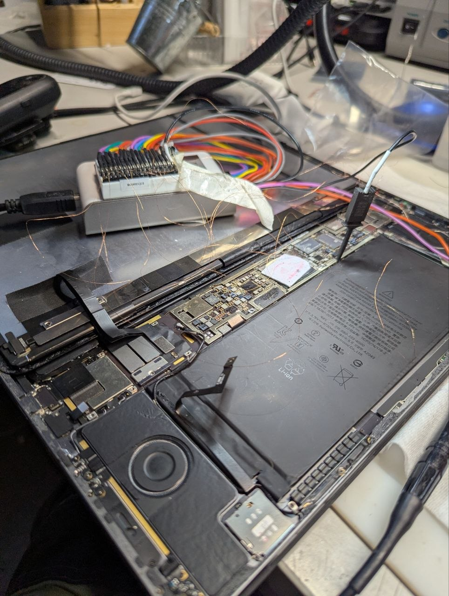

## Scope

On Apple-Silicon-class devices, signal-line analysis — probing the device's internal
management buses with a logic analyzer — is a way to gather diagnostic information
*before* resorting to an SoC swap. CPU swap is often overestimated despite being generally a dangerous procedure. Even if done on controlled BGA Soldering station, CPU and NAND will get thermal shock which might harm and even destroy them - you will never know. 

I will try to describe some methods and ideas about such diagnostics. 

##  iPhone iOS / iPadOS is a diagnostic nightmare if no panic log available.

The iPad Pro 2020 uses the A12Z, a CPU quite similar to the M1 — the Apple
DTK (Developer Transition Kit) even ran macOS on the same A12Z silicon.

Despite that hardware closeness, iPadOS is a very closed box, with close to zero
possibility to troubleshoot bootloops. Recovery and DFU are firmware/restore states, not a usable OS — there is no terminal and no way to mount or read the user data partition, unlike macOS Recovery. The user data is also cryptographically out of reach: on A12-class SoCs (the A12Z included) the Secure Enclave Boot ROM locks the passcode seed bit the moment the device enters DFU or Recovery, so Data Protection class A/B/C data stays encrypted in those modes, and the file-system key hierarchy is rooted in the SEP's fused UID key, which never leaves the AES engine ([src: Apple Platform Security](https://support.apple.com/guide/security/protecting-keys-in-alternate-boot-modes-sece49ec4098/web)). This leaves a very limited
set of diagnostic possibilities. If you don't have panic log which requires you to have mostly functional device, if device goes through soft-update well - you are almost blind, at least it seems bareboard soft-updates quite well, in many cases - iPhone will go through that being halved from its modem board. This is actually a big difference to macOS - macOS would boot with half board dead (sensors, peripherals, controllers) but won't go through software update and fail with useful log entry. Unlike Macs you can't even try old IPSW — every restore needs a fresh Apple-signed ticket tied to the device ECID, and Apple stops signing old versions, so downgrades fail outside the signing window (or without saved SHSH2 blobs). 

Worth noting: on checkm8 / bootrom-exploitable devices (up to A11 - iPhone X and earlier) this is a completely different story. There [checkm8](https://theapplewiki.com/wiki/Checkm8_Exploit) lets you ramdisk-boot and even dump SEP memory, so partial filesystem / BFU (before first unlock) extraction is on the table and you can actually do real diagnostics - the box is barely closed. A12 patched that bootrom hole for good, so on the A12Z (and anything newer) none of it works anymore. That's exactly why this iPad is such a pain - it sits right on the wrong side of that line. User data is secure from being restored. 

It is therefore understandable that standard iPhone/iPad "data recovery" often ends up with
no diagnostic at all and simply a swap. However, a CPU swap carries a certain risk of
further damage even when done properly. General rule of thumb: avoid heating SOC + NAND more than 200C unless completely necessary. Always cover such parts, put heatsinks. 

## The case

An iPad Pro 12.9″ (2020) that caught a bootloop close to the end of boot. 
Sidenote: Usually iPads and iPhones are out of my scope, but customer was referred to me and my knowledge (unfortunately) on scam "standards" of many data recovery companies convinced me to give it a shot. 

*TLDR - I recommended customer to wait till major software update after I fixed DFU mode. That was sort of "gut feeling" but also I did not know symptoms how it went off.   
After few weeks of struggle/analyze, finding a clue in GPU failure, then replacing PMIC, I contacted one very reputable and kind repair colleague with broader expertise ([link below](#special-thanks)) in Apple mobiles, and told me that IS, in fact, most likely a SOFTWARE problem and "swap" won't do anything good to this device, we should wait. Full circle. Hope it works :) .*

## How it died

The device was low on battery, and the GPU supposedly crashed: a grayed-out
UI with a loading circle, which indicates the system waiting on a response from the
hardware GPU driver — supposedly blinked few times and went off.

The bootloop clearly happens exactly on the display-resolution change that shortly
precedes the crash. iPads SoC clearly has two video modes, similar to the Intel iGPU
platform: the GPU is only powered and utilized when there is GPU load (only short power check during SiliconInit EFI POST). I guess GPU is always needed to render the fancy-wobbly translucent Liquid Glass UI of iPadOS 26, but it is not used in the recovery state.

*The built-in recovery state — a low-load screen where the GPU is not utilized. Trying to "recover" immediately "fails" which might actually indicate a software issue. Soft-update ends up with "swipe up to recover data, then falls back to the same bootloop.*

## Findings in this unit

Two distinct issues were found:

1. A damaged CD3217B12 IC: shorted middle D+/D- pair — most likely from ESD, and totally unrelated to the
   actual boot problem. With it damaged, the device was not visible or recognizable
   over USB in DFU mode. This chip unfortunately has OTP (configures BUS_POWER behaviour), so you need to source it (preferably with rom) from the same platform (in my case, iPad Air was compatible enough). 

   *Thanks to David Lecomte and his strap i2c config/BUS_POWER fix method, briefly: (https://logi.wiki/index.php/CD3217_and_T2_Power_on_Sequence), fully:(https://repair.wiki/w/Apple_ACE2_Controllers) Mac OTP was solved, but iPads have clearly a different firmware behaviour (for example, 15V is only negotiated quite deep into iPadOS boot, which is very different). CD3217 also does not have a "dumb" no-smc mode. Also "clean unused" CD3217 with blank OTP tend to work until battery is completely depleted once. It looks like BUS_POWER should be also physically strapped to usb-powered LDO for it to properly work but decided shortcut and replace it from donor.*

2. An absent VDD_GPU during the whole boot phase, together with a clear
   overheating "rainbow" on the VDD_GPU edge of the main PMIC. Turned out to be a useless move, but I replaced the PMIC. I seen such PMIC failed on MacBooks, so why not.

*The main PMIC (343S00832). The oily stain around the chip came from the degraded thermal pad (a bit mixed with IPA), but a clear "rainbow"-like pattern + delaminated corner at pin1 is clearly visible*

*Boardview/schematic (820-01798): the GPU power rail PPVDD_GPU at the SoC (U8100) — inductor L8112 → GPU VDD, L8480 → GPU SRAM. Both DrMOS drivers are placed on "rainbow" edge of the chip.*

## Bus diagnostics

This is where signal-line analysis might (not?) help. The possible paths are I²C and
the  SPMI diagnostic. The SPMI work is based on available sources —
SPMI kext decompilation and a bit documentation available from IC manufacturer.

*Logic analyzer tapped onto the bus lines of the opened iPad. To get to some pads I had to cut metal cover around Logicboard with sidecutters. Since this is data recovery case, optics does not matter and it is the most safe method to get access to both CD3217 ROM and SPMI bridge points. I'm not a fan of drilling shield away since metal dust is a bad spice on such tiny board.*

### I²C

The I²C lines were also checked to rule out a bad audio codec and similar. iPad played the charging
chime, but it was a bit shorter than normal. I first removed the shields to clearly see if one amp could spike warmspot during chime, but unfortunately they were all completely fine. Bad Amp can cause random shutdown or glitch on power supplies. To be 100% sure, I checked if all Amps are responding ACK during init / chime. 

(Here is a video explaining the method on MacBooks, but that's effectively almost identical circuit and Speakeramp on iPad.)


### SPMI (work in progress)

> SPMI (System Power Management Interface) is a two-wire serial bus defined by the
> MIPI Alliance for communication between a system processor and power-management ICs
> (PMICs). — [MIPI Alliance, SPMI specification](https://www.mipi.org/specifications/spmi)

This matters going forward: new Macs, iPads and iPhones use SPMI mostly as the internal
management interface. For example, our not so beloved SN25 communicates solely on SPMI.

A logic-analyzer dump still makes it possible to recognize which device failed to
respond or returned an error code. Unlike I²C, there is currently no public
information on what addresses the devices use, also not listed in schematics — but the mapping could be discovered the
old-school way, by artificially blocking devices one by one during analysis. But unfortunately this won't help to split power domains on PMICs.

What I found:
Master (SoC SMC element) communicates to 3 slave devices, also there is authentication step.
Auth step is basically a very very thin ice - we are already zero steps away from finding that PMIC chips became tied to concrete board (this will effectively end half of repairs/swap method). It already seems to be the case with SN25* on most recent MacBooks (rom+sn25 pairing) but it requires better community-based investigation. 

SIDs found in traffic are not just devices but functional domains. I believe each power block (CPU, GPU, Auxiliary etc) represents a separate domain/SID. This makes SID identification way harder, maybe partially doable with perfectly synced thermal camera or logic analyzer connected to power outputs. 

Good level of decoding will potentially allow to catch power issues and even current sense/voltage values from each power rail. 
Currently i am working on simple streaming adapter to scan SPMI directly.

## Hardware repair becomes weird "firmware hacking" with no light ahead

The efficiency of this method may be marginal on Apple mobile devices. But since SPMI became more or less main way of communicating, decoding might become a replacement of enable signals (effectively SPMI completely substitutes such signals). This tendency could also be observed in Intel PC Laptop domain: instead of normal s0-s5 signals some laptops already implement "virtual wire" signals over eSPI. (see Intel's documentation: the [eSPI Interface Base Specification](https://www.intel.com/content/www/us/en/content-details/841685/enhanced-serial-peripheral-interface-espi-interface-base-specification-for-client-and-server-platforms.html) and the PCH datasheet's [eSPI section](https://edc.intel.com/content/www/us/en/design/products/platforms/details/arrow-lake-s/800-series-chipset-family-platform-controller-hub-pch-datasheet-volume/enhanced-serial-peripheral-interface-espi/), where sleep/power-state signals such as SLP_S3#/S4#/S5# are carried as eSPI "virtual wires" instead of dedicated pins), S* becomes just a GPIO-driven indicator/testpoint. 

## Special thanks

Special thanks to [Rico Cerva](https://www.logicboardrepair.london/) - a true and honest professional. Unfortunately, when i started to dig into the iPad/iPhone data recovery scene, i found scammers and "swap-monkeys" to absolutely dominate the market. 
Meeting such people restores my belief in our trade. 
